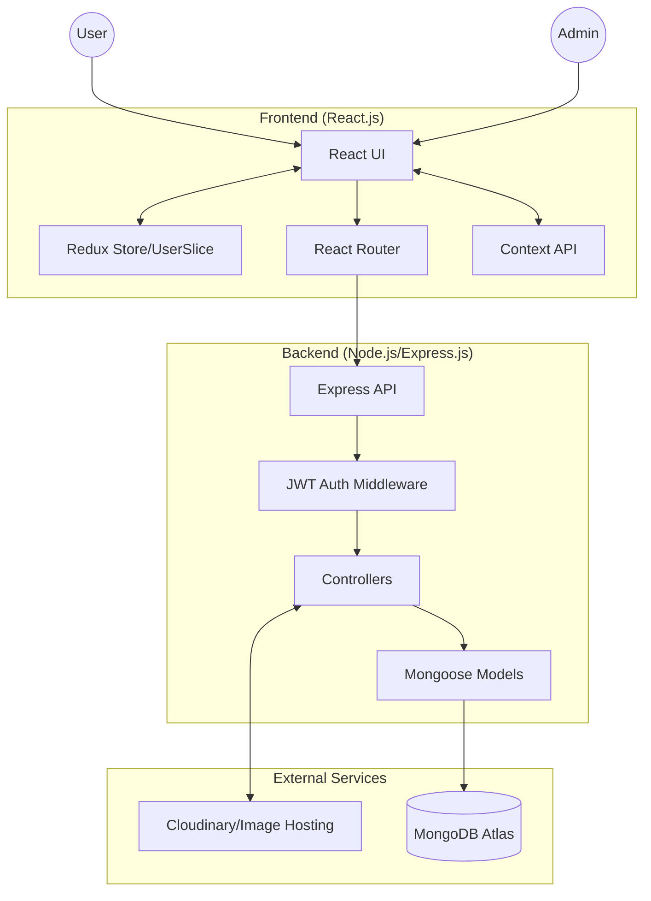

# ⚡ ElectroPlaza - Full Stack E-commerce For Electronics

ElectroPlaza is a comprehensive, production-ready MERN stack e-commerce platform specifically designed for electronic products. It features a robust user interface with advanced product filtering, search capabilities, and a complete administrative dashboard for inventory and user management.

**Live Demo:** (https://e-commerce-frontend-xgf2.onrender.com)

---

## 🏗️ System Architecture

The following diagram illustrates the high-level architecture of ElectroPlaza:



---

## 🌟 Key Features

### 👨‍💻 Customer Experience
- **Responsive Design:** Optimized for mobile, tablet, and desktop using Tailwind CSS.
- **Product Discovery:**
  - Search products by name using full-text search.
  - Category-based navigation and horizontal/vertical product sliders.
  - Advanced filtering based on categories.
- **Shopping Cart:**
  - Real-time cart updates (count and price calculation).
  - Add, update, or remove items with persistent state.
- **Authentication:**
  - Secure User Registration and Login.
  - JWT-based authentication stored in HTTP-only cookies for enhanced security.
  - User profile management.

### 🛠️ Administrative Capabilities
- **Admin Dashboard:** Access-controlled panel for authorized users only.
- **Inventory Management:**
  - Upload new products with multiple images.
  - Update existing product details, pricing, and availability.
- **User Management:**
  - View all registered users.
  - Role-based access control (Admin/General User assignment).

---

## 🚀 Technical Stack

### Frontend
- **React.js:** Single Page Application (SPA) architecture.
- **Redux Toolkit:** Global state management for user authentication and UI state.
- **Tailwind CSS:** Utility-first styling for modern and responsive UI.
- **React Router:** Declarative routing for seamless navigation.

### Backend
- **Node.js & Express.js:** Fast, unopinionated web framework for backend logic.
- **MongoDB & Mongoose:** NoSQL database with schema-based modeling.
- **JWT (JSON Web Token):** Secure token-based authentication.
- **Cookie-Parser:** Handling session cookies securely.

### Cloud Services
- **Cloudinary:** Efficient image hosting and optimization.
- **MongoDB Atlas:** Managed database in the cloud.

---

## ⚙️ Project Structure

```text
e-commerce/
├── backend/            # Express application source code
│   ├── config/         # Database and environment configurations
│   ├── controller/     # Business logic for Users and Products
│   ├── middleware/     # Authentication and permission checks
│   ├── models/         # Mongoose schemas (User, Product, Cart)
│   └── routes/         # API endpoint definitions
├── frontend/           # React application source code
│   ├── src/
│   │   ├── common/     # Global constants and API endpoints
│   │   ├── components/ # Reusable UI components
│   │   ├── helpers/    # Utility functions (Uploads, Currency conversion)
│   │   ├── pages/      # Route-based page components
│   │   └── store/      # Redux store and slices
```

---

## 🛠️ Installation & Setup

### Prerequisites
- Node.js installed
- MongoDB Atlas account
- Cloudinary account

### Step 1: Backend Setup
1. Navigate to the backend folder: `cd backend`
2. Install dependencies: `npm install`
3. Create a `.env` file and add:
   ```env
   PORT = 7070
   MONGO_URI = your_mongodb_connection_string
   JWT_SECRET = your_secret_key
   FRONTEND_URL = http://localhost:3000
   ```
4. Start the server: `npm run dev`

### Step 2: Frontend Setup
1. Navigate to the frontend folder: `cd frontend`
2. Install dependencies: `npm install`
3. Start the application: `npm start`

---

## 👤 Author
**Subhodip Shee**
- GitHub: [@SubhodipShee](https://github.com/SubhodipShee)

---

## 🤝 Contributing
Contributions are welcome! Please feel free to submit a Pull Request. For major changes, please open an issue first to discuss what you would like to change.


